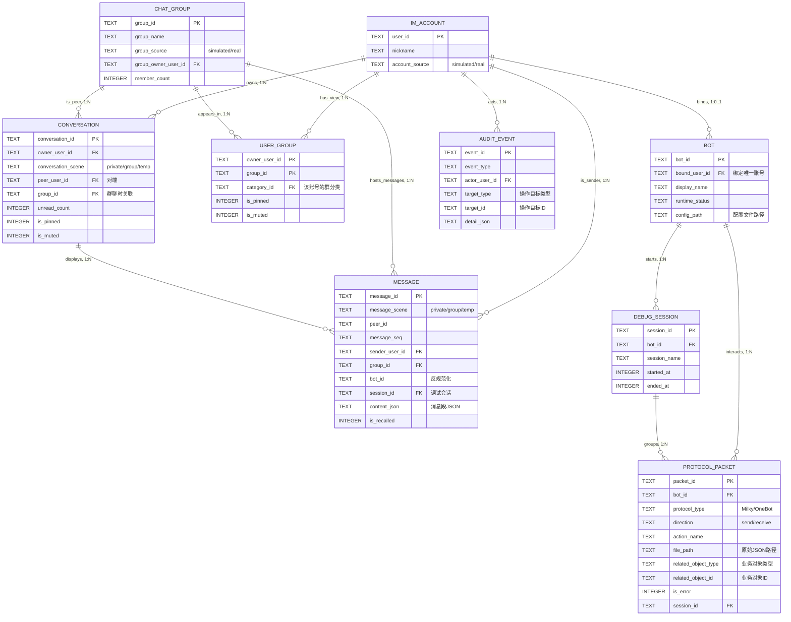
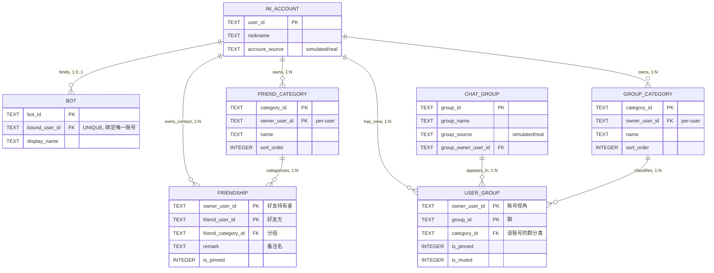
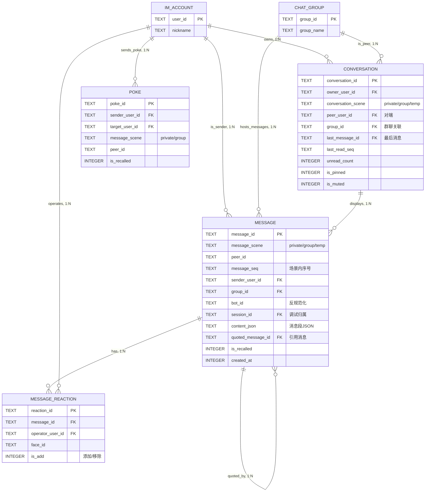
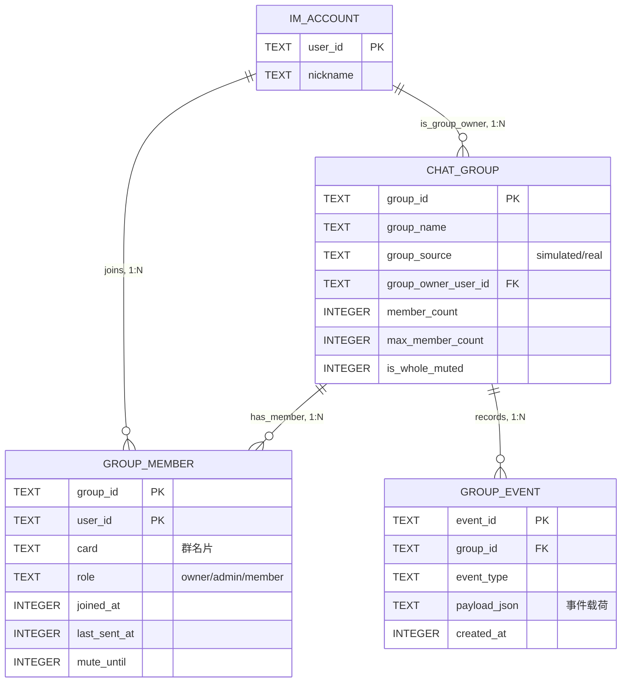
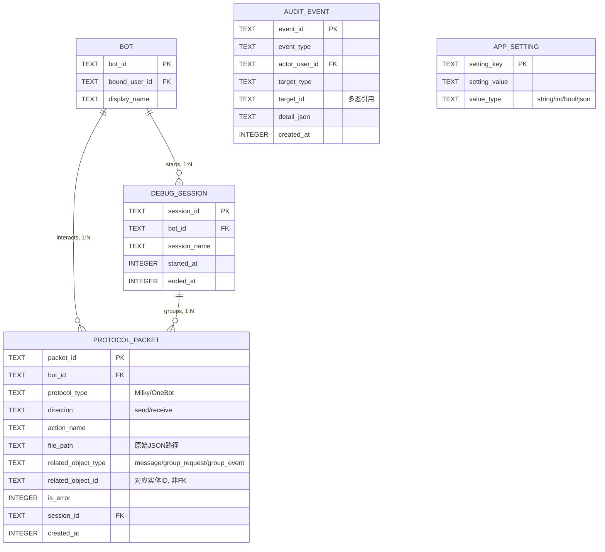

# UniBot 数据库概念结构设计

---

## 1. 设计目标

本节基于需求分析报告，给出 UniBot 数据库的概念结构设计。ER 图用于描述系统需要长期保存的主要实体、实体属性以及实体之间的联系，为后续关系模式转换、主外键设计、规范化分析和索引设计提供依据。

核心设计原则：将需求分析报告中识别的 5 个数据域映射为实体和联系；区分客观实体与账号视角实体，避免将用户私有属性误置入全局实体；大体积非结构化数据（协议原文 JSON）不纳入核心关系模型，仅在协议包记录中保留本地文件路径。

---

## 2. 实体划分

| 数据域 | 主要实体 | 说明 |
| --- | --- | --- |
| 身份与账号域 | IM_ACCOUNT, BOT | 记录外部 IM 账号身份和 Bot 实例 |
| 社交与群组域 | FRIENDSHIP, CHAT_GROUP, USER_GROUP, GROUP_CATEGORY, GROUP_MEMBER | 记录好友关系、群组和账号视角下的群视图 |
| 会话与消息域 | CONVERSATION, MESSAGE, MESSAGE_REACTION, POKE | 记录会话容器、消息和消息级互动 |
| 协议调试域 | DEBUG_SESSION, PROTOCOL_PACKET | 记录调试会话、协议包索引和原始报文文件路径 |
| 系统治理域 | APP_SETTING, AUDIT_EVENT | 记录系统级配置和操作审计 |

---

## 3. 总体 ER 图

下图为系统核心实体的简化总览，展示主要数据流链路：账号 → Bot → 调试会话 → 协议包；账号 → 会话视图 ⇢ 消息事实 → 协议包；账号 → 用户群关系 → 群组。

注：`CONVERSATION → MESSAGE` 表示会话视图展示消息的逻辑联系，不要求 `MESSAGE` 持有 `conversation_id` 外键。

---

## 4. 分域 ER 图

### 4.1 账号与社交域

设计意图：该域用于记录外部 IM 账号身份、Bot 绑定关系，以及好友关系、群分类和账号视角下的群视图。该域的核心问题是区分全局实体（IM_ACCOUNT、CHAT_GROUP）与账号私有实体（FRIENDSHIP、GROUP_CATEGORY、USER_GROUP）。

核心联系：

- IM_ACCOUNT 与 BOT 是 1:0..1 绑定关系，一个账号最多绑定一个 Bot
- FRIENDSHIP 采用 owner 视角双记录模型，每条好友关系在双方视角各有一条记录
- USER_GROUP 独立于 CHAT_GROUP 存在，承载账号视角下的置顶、免打扰和分类归属

说明：群分类、好友分组、群置顶和免打扰均为 per-user 属性，因此 GROUP_CATEGORY 和 USER_GROUP 均归属到 IM_ACCOUNT，而非作为 CHAT_GROUP 的全局属性。这是满足 3NF 的关键设计决策——群分类不应依赖于群，而应依赖于操作该分类的账号。

### 4.2 会话与消息域

设计意图：该域用于记录用户视角下的会话列表、消息内容和消息级互动，是系统访问最频繁的数据域。会话独立建模是为了维护未读数、最后消息、置顶和免打扰等视图状态，避免每次从消息表动态聚合。

核心联系：

- 一个 IM_ACCOUNT 拥有多个 CONVERSATION。
- 一个 CONVERSATION 作为账号视角下的会话视图，可展示多条与其 scene 和 peer 匹配的 MESSAGE。
- MESSAGE 可通过 `session_id` 归属调试会话，通过 `bot_id` 反规范化快速定位处理 Bot。
- MESSAGE 支持自引用（`quoted_message_id`），实现回复链。

说明：`CONVERSATION` 是 per-user 会话视图，负责维护未读数、最后消息、置顶、免打扰、最后已读序号等账号视角状态；`MESSAGE` 是协议归一化后的消息事实，记录消息发送者、消息场景、对端或群、协议序号、内容和时间。二者在概念上形成"会话展示消息"的联系，但不表示 `MESSAGE` 必须从属于某个 `CONVERSATION`。后续关系模式可通过会话的 `conversation_scene + peer_user_id/group_id` 与消息的 `message_scene + peer_id/group_id` 建立逻辑关联。`bot_id` 是有意的反规范化——记录处理该消息的 Bot 实例，避免"某 Bot 处理了哪些消息"这一核心调试查询需要构造 3 表 JOIN。

### 4.3 群组与内容域

设计意图：该域记录群本身的属性、群成员信息，以及协议端返回的群公告、群文件、群精华消息和群事件等低频内容缓存。

核心联系：

- CHAT_GROUP 记录群本身的结构化属性（群名、群主、成员数、全员禁言状态）
- GROUP_MEMBER 以联合主键 `(group_id, user_id)` 记录成员身份
- GROUP_EVENT 以追加方式记录群内事件，事件载荷以 JSON 存储

说明：群公告、群文件、群相册等低频内容实体（GROUP_ANNOUNCEMENT、GROUP_FILE、GROUP_FOLDER、GROUP_ALBUM、GROUP_PHOTO、GROUP_ESSENCE_MESSAGE）未在本分图中展开，设计模式与此域一致——均以 CHAT_GROUP 为父实体，与群形成一对多联系；具体外键和删除策略在后续关系模式设计中确定。

### 4.4 调试与系统治理域

设计意图：该域是 UniBot 区别于普通 IM 客户端的关键数据域。协议包元数据入数据库以支持多维度筛选查询；原始协议 JSON 交由文件系统存储，数据库在 PROTOCOL_PACKET 中直接保存 `file_path`。查看原文时按路径读取，若文件已被外部删除，则在界面提示“文件已丢失或过期”。

核心联系：

- Bot 启动时自动创建 DEBUG_SESSION，停止时记录结束时间
- 该会话期间的消息（MESSAGE.session_id）和协议包（PROTOCOL_PACKET.session_id）均归属该会话
- PROTOCOL_PACKET 直接保存原始 JSON 的 `file_path`，不再拆分独立文件实体

说明：为保持调试域分图简洁，`MESSAGE` 未在本图中重复展示；实际模型中 `MESSAGE.session_id` 可关联到 `DEBUG_SESSION`。PROTOCOL_PACKET 的 `related_object_type` + `related_object_id` 为多态关联，可指向 MESSAGE、GROUP_REQUEST 或 GROUP_EVENT。该设计用于处理协议包可能关联多种业务对象的情况；若强行建立多个可空外键，会增加表结构复杂度，并使协议包表随业务对象类型扩展而频繁变化。AUDIT_EVENT 同样使用 `target_type` + `target_id` 多态引用操作目标。协议包文件采用懒惰检查：只有查看或导出原文时才读取 `file_path`，读取失败时向用户报告文件缺失。

---

## 5. 关键联系说明

### 5.1 CHAT_GROUP 与 USER_GROUP 分离

CHAT_GROUP 表示群本身的全局信息（群名、群主、成员数），USER_GROUP 表示某个账号视角下的群关系（是否置顶、所属分类、是否免打扰）。群分类、置顶和免打扰是账号私有属性，放在 USER_GROUP 中而非 CHAT_GROUP 中。如果将这些属性放入 CHAT_GROUP，将导致一个群只能有一套置顶/免打扰状态，无法满足不同用户对同一群的不同组织方式。

### 5.2 MESSAGE 与 PROTOCOL_PACKET 分离

MESSAGE 表示业务消息事实（用户看到的消息），PROTOCOL_PACKET 表示底层协议交互（Bot 实际收发的事件和 API 调用）。两者分离使得消息展示和协议调试可以独立演化。一条消息可能对应一个入站协议事件，而 Bot 为回复该消息可能发出多个 API 调用，每个调用均记录为独立的 PROTOCOL_PACKET。

### 5.3 PROTOCOL_PACKET 直接保存文件路径

协议包结构化元数据（协议类型、方向、action、错误标记）存数据库以支持多维度组合筛选；原始 JSON 报文存文件系统以减少数据库体积和写入压力。由于 UniBot 是本地桌面调试工具，协议报文文件只需在 PROTOCOL_PACKET 中保存 `file_path`。读取时直接访问该路径，读得出则展示，读不到则提示文件已丢失或过期。

### 5.4 FRIENDSHIP 采用 Owner 视角双记录模型

每对好友关系在双方视角下各有一条记录，允许双方分别设置不同的备注名和置顶状态。相比之下，对称模型（一对好友一条记录）无法表达这种非对称属性。这一设计直接对应 QQ 协议端的数据模型——每个用户独立管理自己的好友列表、备注和分组。

### 5.5 AUDIT_EVENT 使用多态目标

审计事件的操作目标可能是 Bot、消息、协议包或账号，因此使用 `target_type` + `target_id` 的多态关联，而非为每类目标建立单独的外键列。这避免了审计表随目标类型增加而不断扩充列。

---

## 6. 设计合理性说明

本 ER 设计将系统数据划分为五个相对独立的数据域，核心业务数据（账号、Bot、会话、消息）、缓存数据（群组、好友、成员）、协议调试数据（协议包、调试会话）和系统治理数据（审计、配置）边界清楚。

会话、消息、协议包、调试会话等核心实体均可从需求分析报告中的 5 个业务场景（S1–S5）直接推导：S1 对应 BOT、IM_ACCOUNT、DEBUG_SESSION；S2 对应 CONVERSATION、MESSAGE；S3 对应 PROTOCOL_PACKET；S4 对应 CHAT_GROUP、USER_GROUP、GROUP_CATEGORY；S5 对应 PROTOCOL_PACKET、AUDIT_EVENT。

对于账号视角属性（群分类、置顶、免打扰、好友备注），设计中通过 USER_GROUP 和 FRIENDSHIP 等 per-user 实体表达，避免将用户私有属性错误放入全局群实体（CHAT_GROUP）。对于原始协议 JSON 等大体积非结构化数据，ER 图中仅在 PROTOCOL_PACKET 保留文件路径，避免将文件内容直接纳入核心关系模型。

实体标识优先采用稳定且语义清晰的业务标识（如 `user_id`、`group_id`）；对于调试会话、协议包、审计事件等系统内部对象，使用系统生成 ID 作为主键，兼顾业务可读性与内部对象唯一性。

---

## 7. 与需求的对应关系

| 需求功能域 | 对应实体 |
| --- | --- |
| 账号与 Bot 管理（4.1） | IM_ACCOUNT, BOT |
| 会话与消息管理（4.2） | CONVERSATION, MESSAGE, MESSAGE_REACTION, POKE |
| 社交资料缓存（4.3） | FRIENDSHIP, FRIEND_CATEGORY, CHAT_GROUP, GROUP_MEMBER, USER_GROUP, GROUP_CATEGORY |
| 协议包追踪（4.4） | PROTOCOL_PACKET |
| 调试会话管理（4.5） | DEBUG_SESSION（关联 BOT、MESSAGE、PROTOCOL_PACKET） |
| 审计与维护（4.6） | AUDIT_EVENT, APP_SETTING |

---

本文作为概念结构设计文档，将作为后续关系模式转换（将 ER 图映射为关系表结构）、主外键约束设计、索引设计和 3NF 分析的依据。
