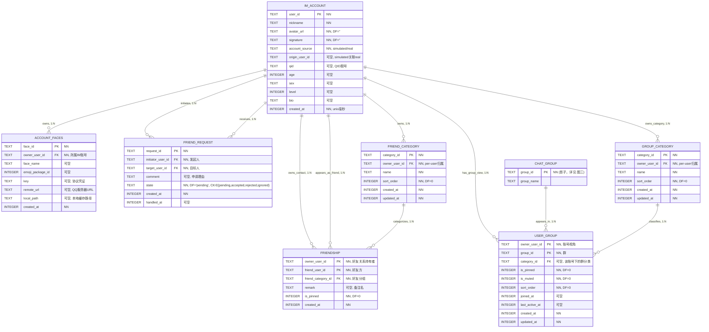
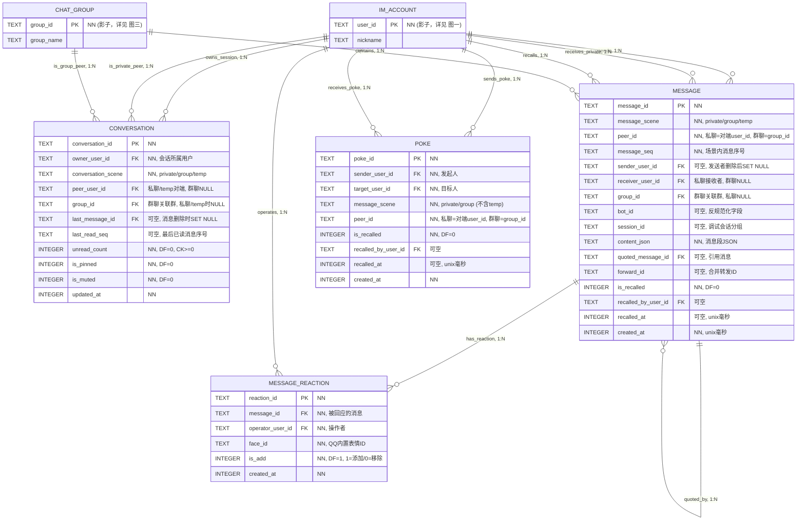
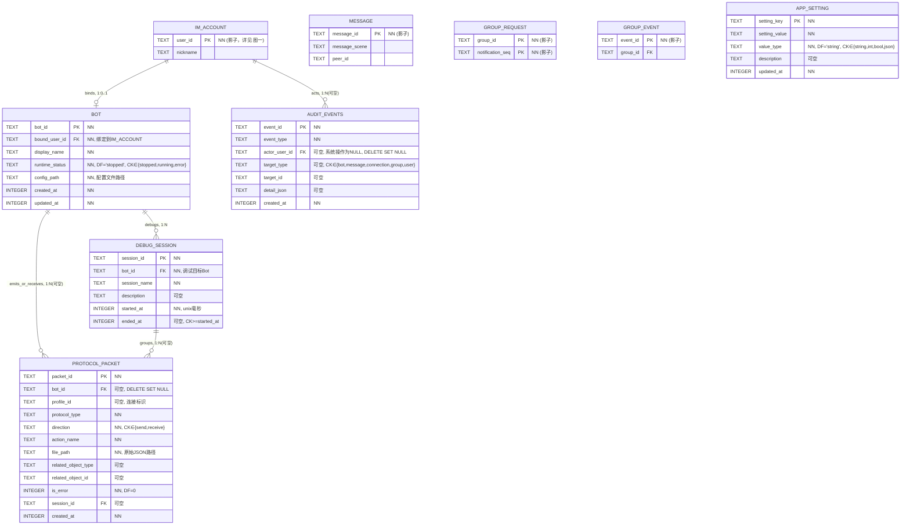

# ER 模型

26 张表的实体关系模型，按 5 个数据域组织为 4 张 ER 图。跨域引用以影子实体呈现，群组与内容域因自身包含 10 张表而单独成图。

## 1. 数据域与 ER 图映射

| ER 图 | 覆盖领域 | 核心实体数 | 影子实体数 |
|---|---|---|---|
| 图一：账号与社交域 | 身份与社交域 | 7 | 1 |
| 图二：会话与消息域 | 会话与消息域 | 4 | 2 |
| 图三：群组与内容域 | 群组与内容域 | 10 | 3 |
| 图四：Bot 调试与系统治理域 | Bot 与调试域 + 系统治理域 | 6 | 4 |

## 2. 图一：账号与社交域

覆盖 IM_ACCOUNT、ACCOUNT_FACES、FRIENDSHIP、FRIEND_REQUEST、FRIEND_CATEGORY、GROUP_CATEGORY、USER_GROUP。CHAT_GROUP 以影子实体出现（USER_GROUP 引用）。Bot 绑定关系在图四展示。



### 关系基数

| 关系 | 基数 | 说明 |
|---|---|---|
| IM_ACCOUNT → FRIENDSHIP | 1:N (双向) | owner 维度和 friend 维度各自 1:N |
| IM_ACCOUNT → FRIEND_REQUEST | 1:N (双向) | 发起方和目标方各自 1:N |
| IM_ACCOUNT → FRIEND_CATEGORY | 1:N | 每个账号独立管理分组 |
| IM_ACCOUNT → GROUP_CATEGORY | 1:N | 每个账号独立管理群分类 |
| IM_ACCOUNT → USER_GROUP | 1:N | 每个账号独立管理自己的群视图 |
| CHAT_GROUP → USER_GROUP | 1:N | 一个群可出现在多个账号的视图中 |
| GROUP_CATEGORY → USER_GROUP | 1:N | category_id ON DELETE SET NULL |
| FRIEND_CATEGORY → FRIENDSHIP | 1:N | 好友必须入组（friend_category_id NOT NULL, ON DELETE RESTRICT） |

### 关键约束

- `FRIENDSHIP`: UNIQUE(owner_user_id, friend_user_id) — 同一 owner 对同一好友只有一条记录
- `FRIEND_REQUEST`: 部分唯一索引 `UNIQUE(initiator_user_id, target_user_id) WHERE state='pending'` — 同一对用户不重复发起待处理申请
- `FRIEND_CATEGORY`: ON DELETE RESTRICT — 有好友时不能删除分组
- `GROUP_CATEGORY`: per-user 归属；删除分类时 `USER_GROUP.category_id` SET NULL；`UNIQUE(owner_user_id, name)` 同账号下不重名
- `USER_GROUP`: 联合 PK `(owner_user_id, group_id)`。`category_id` 用单列 FK → `group_categories(category_id) ON DELETE SET NULL`，保证分类存在。由于 `GROUP_CATEGORY` 是账号私有分类，还必须保证分类属于同一 `owner_user_id`——该约束无法通过单列 FK 表达，复合 FK 会与 `ON DELETE SET NULL` 对 `owner_user_id` 的语义冲突，因此通过 `BEFORE INSERT/UPDATE` 触发器校验

## 3. 图二：会话与消息域

覆盖 CONVERSATION、MESSAGE、MESSAGE_REACTION、POKE。IM_ACCOUNT 和 CHAT_GROUP 为影子实体。



### 关系基数

| 关系 | 基数 | 说明 |
|---|---|---|
| IM_ACCOUNT → CONVERSATION | 1:N (owner) + 1:N (peer) | 会话属主和对端分别关联 |
| CHAT_GROUP → CONVERSATION | 1:N | 群会话 |
| IM_ACCOUNT → MESSAGE | 1:N (发送/接收/撤回) | sender_user_id SET NULL 保留消息 |
| CHAT_GROUP → MESSAGE | 1:N | group_id SET NULL 保留消息 |
| MESSAGE → MESSAGE_REACTION | 1:N | message_id CASCADE |
| MESSAGE → MESSAGE | 1:N (引用) | quoted_message_id SET NULL |

### 关键约束

- `CONVERSATION`: conversation_scene 驱动的 CHECK 互斥 — private/temp 时 peer_user_id NN ∧ group_id NULL；group 时相反
- `CONVERSATION`: 部分唯一索引 — `UNIQUE(owner_user_id, conversation_scene, peer_user_id) WHERE conversation_scene IN ('private','temp')`；`UNIQUE(owner_user_id, conversation_scene, group_id) WHERE conversation_scene = 'group'`。使用部分索引而非普通 UNIQUE 约束，因为 peer_user_id/group_id 互斥为 NULL，普通 UNIQUE 对 nullable 列不保证唯一性
- `MESSAGE`: UNIQUE(message_scene, peer_id, message_seq) — 业务唯一标识
- `MESSAGE`: message_scene 驱动的 CHECK 互斥 — 同 CONVERSATION 模式
- `MESSAGE.forward_id`: 合并转发标识符，非 FK，用于兜底补拉完整转发内容
- `MESSAGE_REACTION`: 不对 `(message_id, operator_user_id, face_id)` 建历史唯一约束；添加/移除都以 `is_add` 追加记录，当前重复添加由应用层按净状态拦截
- `MESSAGE.bot_id`: 有意的反规范化——记录处理该消息的 Bot 实例，避免调试核心查询的 3 表 JOIN
- `POKE.peer_id`: 多态标识——私聊时为对端 user_id，群聊时为 group_id。不建 FK，由 `message_scene` 决定语义。与 MESSAGE.peer_id 同模式

## 4. 图三：群组与内容域

覆盖 CHAT_GROUP、GROUP_MEMBER、GROUP_REQUEST、GROUP_ANNOUNCEMENT、GROUP_FOLDER、GROUP_FILE、GROUP_ESSENCE_MESSAGE、GROUP_EVENT、GROUP_ALBUM、GROUP_PHOTO。IM_ACCOUNT、MESSAGE 为影子实体。USER_GROUP（账号-群视图）在图一展示。

```mermaid
erDiagram
    IM_ACCOUNT {
        TEXT user_id PK "NN (影子，详见 图一)"
        TEXT nickname
    }

    MESSAGE {
        TEXT message_id PK "NN (影子，详见 图二)"
        TEXT message_scene
        TEXT peer_id
        TEXT sender_user_id FK
    }

    CHAT_GROUP {
        TEXT group_id PK "NN"
        TEXT group_name "NN"
        TEXT group_source "NN, CK∈{simulated,real}"
        TEXT avatar_url "可空"
        TEXT group_owner_user_id FK "可空, 真实群主"
        INTEGER member_count "NN, DF=0, CK>=0且<=max_member_count"
        INTEGER max_member_count "NN, DF=500"
        INTEGER is_whole_muted "NN, DF=0"
        INTEGER mute_until "可空"
        TEXT mute_operator_user_id FK "可空"
        INTEGER created_at "NN"
        INTEGER updated_at "NN"
    }

    GROUP_MEMBER {
        TEXT group_id PK "NN"
        TEXT user_id PK "NN"
        TEXT card "NN, DF='', 群名片"
        TEXT special_title "可空, DF=''"
        TEXT role "NN, DF='member', CK∈{owner,admin,member}"
        INTEGER joined_at "NN"
        INTEGER last_sent_at "NN, DF=0"
        INTEGER mute_until "可空"
    }

    GROUP_REQUEST {
        TEXT group_id PK "NN"
        TEXT notification_seq PK "NN"
        TEXT notification_type "NN, join_request/invite"
        TEXT initiator_user_id FK "NN"
        TEXT target_user_id FK "可空"
        TEXT comment "可空"
        TEXT state "NN, DF='pending', CK∈{pending,accepted,rejected,ignored}"
        INTEGER created_at "NN"
        INTEGER handled_at "可空"
        TEXT operator_user_id FK "可空"
    }

    GROUP_ANNOUNCEMENT {
        TEXT announcement_id PK "NN"
        TEXT group_id FK "NN"
        TEXT sender_user_id FK "NN"
        TEXT content "NN"
        TEXT image_url "可空"
        INTEGER created_at "NN"
        INTEGER updated_at "NN"
    }

    GROUP_FOLDER {
        TEXT folder_id PK "NN"
        TEXT group_id FK "NN"
        TEXT parent_folder_id FK "可空, 根目录为NULL"
        TEXT folder_name "NN"
        TEXT creator_user_id FK "NN"
        INTEGER created_at "NN"
        INTEGER updated_at "NN"
    }

    GROUP_FILE {
        TEXT file_id PK "NN"
        TEXT group_id FK "NN"
        TEXT parent_folder_id FK "可空, NULL=群文件根目录"
        TEXT file_name "NN"
        INTEGER file_size "NN"
        TEXT file_hash "可空"
        TEXT uploader_user_id FK "NN"
        INTEGER created_at "NN"
        INTEGER expire_at "可空"
        INTEGER download_count "NN, DF=0"
    }

    GROUP_ESSENCE_MESSAGE {
        TEXT essence_id PK "NN"
        TEXT group_id FK "NN"
        TEXT message_id FK "可空, 消息删除后SET NULL"
        TEXT sender_user_id FK "NN"
        TEXT operator_user_id FK "NN"
        INTEGER created_at "NN"
    }

    GROUP_EVENT {
        TEXT event_id PK "NN"
        TEXT group_id FK "NN"
        TEXT event_type "NN"
        TEXT payload_json "NN, 事件载荷JSON"
        INTEGER created_at "NN"
    }

    GROUP_ALBUM {
        TEXT album_id PK "NN"
        TEXT group_id FK "NN"
        TEXT name "NN"
        TEXT cover_url "可空"
        INTEGER created_at "NN"
        INTEGER updated_at "NN"
    }

    GROUP_PHOTO {
        TEXT photo_id PK "NN"
        TEXT album_id FK "NN"
        TEXT url "NN"
        TEXT description "可空"
        TEXT uploader_user_id FK "NN"
        INTEGER file_size "可空"
        INTEGER created_at "NN"
    }

    IM_ACCOUNT ||--o{ CHAT_GROUP : "is_group_owner, 1:N"
    CHAT_GROUP ||--o{ GROUP_MEMBER : "has_member, 1:N"
    IM_ACCOUNT ||--o{ GROUP_MEMBER : "joins, 1:N"
    CHAT_GROUP ||--o{ GROUP_REQUEST : "receives, 1:N"
    IM_ACCOUNT ||--o{ GROUP_REQUEST : "initiates, 1:N"
    IM_ACCOUNT ||--o{ GROUP_REQUEST : "targets, 1:N"
    IM_ACCOUNT ||--o{ GROUP_REQUEST : "handles, 1:N"
    CHAT_GROUP ||--o{ GROUP_ANNOUNCEMENT : "has, 1:N"
    IM_ACCOUNT ||--o{ GROUP_ANNOUNCEMENT : "publishes, 1:N"
    CHAT_GROUP ||--o{ GROUP_FOLDER : "has, 1:N"
    GROUP_FOLDER ||--o{ GROUP_FOLDER : "parent_of, 1:N"
    GROUP_FOLDER ||--o{ GROUP_FILE : "contains, 1:N"
    CHAT_GROUP ||--o{ GROUP_FILE : "has, 1:N"
    IM_ACCOUNT ||--o{ GROUP_FILE : "uploads, 1:N"
    CHAT_GROUP ||--o{ GROUP_ESSENCE_MESSAGE : "has, 1:N"
    MESSAGE ||--o{ GROUP_ESSENCE_MESSAGE : "marked_as, 1:N"
    IM_ACCOUNT ||--o{ GROUP_ESSENCE_MESSAGE : "sends_original, 1:N"
    IM_ACCOUNT ||--o{ GROUP_ESSENCE_MESSAGE : "operates, 1:N"
    CHAT_GROUP ||--o{ GROUP_EVENT : "records, 1:N"
    CHAT_GROUP ||--o{ GROUP_ALBUM : "has_album, 1:N"
    GROUP_ALBUM ||--o{ GROUP_PHOTO : "contains_photo, 1:N"
    IM_ACCOUNT ||--o{ GROUP_PHOTO : "uploads_photo, 1:N"
```



### 关系基数

| 关系 | 基数 | 说明 |
|---|---|---|
| IM_ACCOUNT → CHAT_GROUP | 1:N | 群主关联（group_owner_user_id） |
| CHAT_GROUP → GROUP_MEMBER | 1:N | 联合 PK (group_id, user_id) |
| CHAT_GROUP → GROUP_REQUEST | 1:N | 联合 PK (group_id, notification_seq) |
| CHAT_GROUP → GROUP_ANNOUNCEMENT | 1:N | 公告随群 CASCADE |
| CHAT_GROUP → GROUP_FOLDER | 1:N | 文件夹随群 CASCADE |
| GROUP_FOLDER → GROUP_FOLDER | 1:N (自关联) | parent_folder_id CASCADE |
| GROUP_FOLDER → GROUP_FILE | 1:N | 文件随文件夹 CASCADE |
| GROUP_ALBUM → GROUP_PHOTO | 1:N | 照片随相册 CASCADE |

### 关键约束

- `GROUP_MEMBER`: 联合 PK (group_id, user_id)；触发器维护 `chat_groups.member_count`
- `GROUP_MEMBER`: 环境隔离触发器 — 校验 `account_source` 与 `group_source` 一致
- `GROUP_REQUEST`: 联合 PK (group_id, notification_seq)；部分索引 `WHERE state='pending'`
- `GROUP_ESSENCE_MESSAGE`: message_id 可空（`ON DELETE SET NULL`，消息删除后精华保留）；UNIQUE(group_id, message_id) — 一条消息一个群内最多加精一次（NULL 时唯一约束不生效，可接受）
- `GROUP_ESSENCE_MESSAGE.message_id`: `TEXT FK "可空, 消息删除后SET NULL"`
- `GROUP_EVENT`: 业务语义上只追加不修改；物理清理由生命周期策略控制，区别于 GROUP_REQUEST 有状态机
- `CHAT_GROUP`: 全员禁言内嵌 `is_whole_muted`/`mute_until`，不独立建表

## 5. 图四：Bot 调试与系统治理域

覆盖 BOT、DEBUG_SESSION、PROTOCOL_PACKET、AUDIT_EVENTS、APP_SETTING。IM_ACCOUNT、MESSAGE、GROUP_REQUEST、GROUP_EVENT 为影子实体。



### 关系基数

| 关系 | 基数 | 说明 |
|---|---|---|
| IM_ACCOUNT → BOT | 1:0..1 | 一个账号最多绑定一个 Bot；Bot 必须绑定账号 |
| IM_ACCOUNT → AUDIT_EVENTS | 1:N (可空) | actor_user_id ON DELETE SET NULL，系统操作为 NULL |
| BOT → DEBUG_SESSION | 1:N | bot_id ON DELETE CASCADE |
| BOT → PROTOCOL_PACKET | 1:N (可空) | bot_id ON DELETE SET NULL，系统级报文不关联 Bot |
| DEBUG_SESSION → PROTOCOL_PACKET | 1:N (可空) | session_id ON DELETE SET NULL |

### 关键约束

- `BOT.bound_user_id`: UNIQUE — 一个 IM 账号最多绑定一个 Bot
- `BOT.config_path`: 指向文件系统 JSON 配置文件，不存 JSON 内容
- `PROTOCOL_PACKET.related_object_type` + `related_object_id`：多态关联，**不是 FK**，由应用层保证引用完整性
- `PROTOCOL_PACKET.file_path`：直接保存原始 JSON 文件路径。查看或导出原文时按路径懒惰读取；文件缺失时由 UI 提示“文件已丢失或过期”
- `AUDIT_EVENTS`：保留期内只追加，按类型执行保留策略，`target_type` + `target_id` 多态引用
- `APP_SETTING`：全局键值对，`schema.version` 键管理当前 schema 版本
- `DEBUG_SESSION`：归属于 BOT 域（逻辑上），在图四中因与 PROTOCOL_PACKET 关联而一同展示

## 6. 跨域关系总览

```text
                    ┌──────────────────┐       ┌──────────────────┐
                    │   IM_ACCOUNT     │       │   CHAT_GROUP     │
                    │   (图一)          │       │   (图三)          │
                    └──┬───────┬───────┘       └───────┬──────────┘
                       │       │                       │
          ┌────────────┤       ├──────────┐            ├────────────────┐
          ↓            ↓                  ↓            ↓                ↓
   ┌──────────┐ ┌──────────┐      ┌──────────┐ ┌──────────┐    ┌──────────┐
   │  BOT     │ │CONVERSAT.│      │  USER_   │ │CONVERSAT.│    │  GROUP_  │
   │ (图四)    │ │(图二)     │      │  GROUP   │ │(图二)     │    │ MEMBER   │
   └────┬─────┘ └────┬─────┘      │ (图一)    │ └────┬─────┘    │ (图三)    │
        │            │            └──────────┘      │          └────┬─────┘
        ↓            ↓                              ↓               ↓
   ┌──────────┐ ┌──────────┐                  ┌──────────┐   ┌──────────┐
   │  DEBUG   │ │ MESSAGE  │←─────────────────│  GROUP_  │   │  GROUP_  │
   │ SESSION  │ │ (图二)    │   引用           │ REQUEST  │   │  EVENT   │
   │ (图四)    │ └────┬─────┘                  │ (图三)    │   │ (图三)    │
   └────┬─────┘      │                        └──────────┘   └──────────┘
        │            │
        ↓            ↓
   ┌─────────────────────────────────────────┐
   │           PROTOCOL_PACKET (图四)          │
   │  related_object_type + related_object_id │
   │  多态关联 MESSAGE / GROUP_REQUEST /       │
   │           GROUP_EVENT                    │
   └─────────────────────────────────────────┘
```

### 跨域 FK 引用矩阵

| 源表 (域) | 目标表 (域) | FK 字段 | 类型 |
|---|---|---|---|
| BOT (Bot 调试) | IM_ACCOUNT (身份) | bound_user_id | 标准 FK |
| USER_GROUP (身份与社交) | IM_ACCOUNT (身份) | owner_user_id | 标准 FK |
| USER_GROUP (身份与社交) | CHAT_GROUP (群组) | group_id | 标准 FK |
| USER_GROUP (身份与社交) | GROUP_CATEGORY (身份) | category_id | 标准 FK；同 owner 一致性由触发器校验（单列 FK 保证存在，触发器保证分类属于同一 owner_user_id） |
| CONVERSATION (会话) | IM_ACCOUNT (身份) | owner_user_id, peer_user_id | 标准 FK |
| CONVERSATION (会话) | CHAT_GROUP (群组) | group_id | 标准 FK |
| MESSAGE (会话) | IM_ACCOUNT (身份) | sender_user_id, receiver_user_id | 标准 FK |
| MESSAGE (会话) | CHAT_GROUP (群组) | group_id | 标准 FK |
| MESSAGE (会话) | DEBUG_SESSION (Bot 调试) | session_id | 标准 FK |
| CHAT_GROUP (群组) | IM_ACCOUNT (身份) | group_owner_user_id | 标准 FK |
| GROUP_ESSENCE_MESSAGE (群组) | MESSAGE (会话) | message_id | 标准 FK |
| PROTOCOL_PACKET (协议) | BOT (Bot 调试) | bot_id | 标准 FK |
| PROTOCOL_PACKET (协议) | DEBUG_SESSION (Bot 调试) | session_id | 标准 FK |
| PROTOCOL_PACKET (协议) | MESSAGE (会话) | related_object_id | 多态(非FK) |
| PROTOCOL_PACKET (协议) | GROUP_REQUEST (群组) | related_object_id | 多态(非FK) |
| PROTOCOL_PACKET (协议) | GROUP_EVENT (群组) | related_object_id | 多态(非FK) |

## 7. 设计模式说明

### 7.1 影子实体

跨域 ER 图中引用非本域实体时，仅画出 PK + 被引用字段，标注"详见 图X"。这避免了在每张图中重复完整实体定义，同时保持图面可读性。

### 7.2 多态关联

`PROTOCOL_PACKET` 的 `related_object_type` + `related_object_id` 对三种业务实体（MESSAGE / GROUP_REQUEST / GROUP_EVENT）建立关联。这不是传统 FK 约束：
- `related_object_type` 的值是运行时决定的，SQLite 不能对多张表建同一个 FK
- 应用层在写入报文时填充这对字段，读取时根据 type 决定 JOIN 哪张表
- 类似地，`AUDIT_EVENTS.target_type` + `target_id` 也是多态关联

### 7.3 Owner 视角

`FRIENDSHIP` 使用 `(owner_user_id, friend_user_id)` 复合主键，每对好友在双方视角各有一条记录。这与对称模型（一对好友一条记录，`CHECK(user_low < user_high)`）的区别：

| 对比维度 | 对称模型 | Owner 视角模型 |
|---|---|---|
| 每对好友记录数 | 1 条 | 2 条 |
| 备注存储 | 无法按人区分 | 各自独立备注 |
| 置顶状态 | 全局 | 各自独立置顶 |
| Milky 协议对齐 | 不完全 | 完全匹配 |

### 7.4 反规范化

`MESSAGE.bot_id` 记录处理该消息的 Bot 实例（Bot 收发的消息均标记）。此字段无法从其他列推导——`sender_user_id` 标识的是 IM 账号而非 Bot。为"Bot X 的所有消息"这一调试核心查询性能将其反规范化到消息表，使得单表 `WHERE bot_id = 'X'` 即可完成查询。

### 7.5 JSON 字段策略

三个字段使用 JSON 存储可变结构，不进一步规范化：

| 字段 | 所属表 | 原因 |
|---|---|---|
| `content_json` | MESSAGE | 消息段类型和数量由协议端决定，无法预知所有字段 |
| `payload_json` | GROUP_EVENT | 事件类型多样，统一 schema 导致大量 NULL 列 |
| `detail_json` | AUDIT_EVENTS | 不同 event_type 字段结构不同 |

原始协议 JSON（`PROTOCOL_PACKET` 对应内容）**不存数据库**，走文件系统；数据库仅在 `PROTOCOL_PACKET.file_path` 保存路径。原因是高频大文本 INSERT 会阻塞 SQLite 单写者锁。

### 7.6 环境隔离

模拟（simulated）与真实（real）环境通过字段值区分，不分表。`IM_ACCOUNT.account_source` 和 `CHAT_GROUP.group_source` 标记环境来源。数据库层由 `GROUP_MEMBER` 的 BEFORE INSERT 触发器强制校验同源性，防止模拟账号加入真实群或反之。
